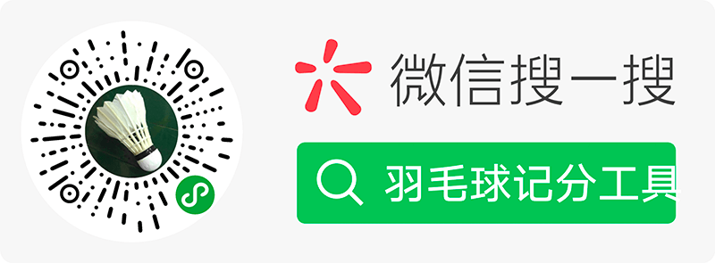

<h2> Hey there! I'm wangmeijian.</h2>

<h3> 👨🏻‍💻 About Me </h3>

- 🔭 &nbsp; 前端开发者
- 🌱 &nbsp; [@ant-design](https://github.com/ant-design/pro-components) Contributor
- 🌱 &nbsp; [@rect-component](https://github.com/react-component) Contributor

<h3>💻 My Project</h3>

<h4>1. 浏览器插件 - 自动剪切板 1500+用户</h4>
  

[Chrome版](https://chrome.google.com/webstore/detail/inhnhgihdkbalmmojcbpalkkmhkmcdjm)  
[Edge版](https://microsoftedge.microsoft.com/addons/detail/oecjpmpbghigjifackhbapkamgaemnkj)  

<h4 style="clear: both;">2. 微信小程序 - 羽毛球记分工具 10000+用户</h4>
  

<h3>🤔 Contact Me</h3>

&nbsp; 
